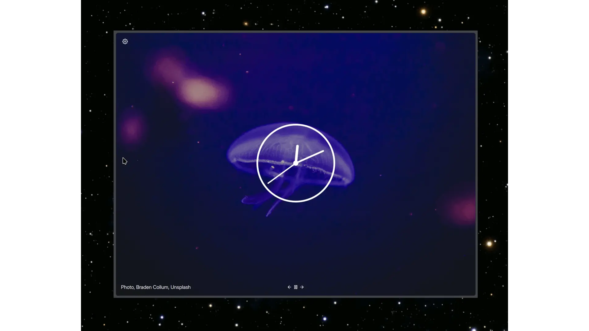
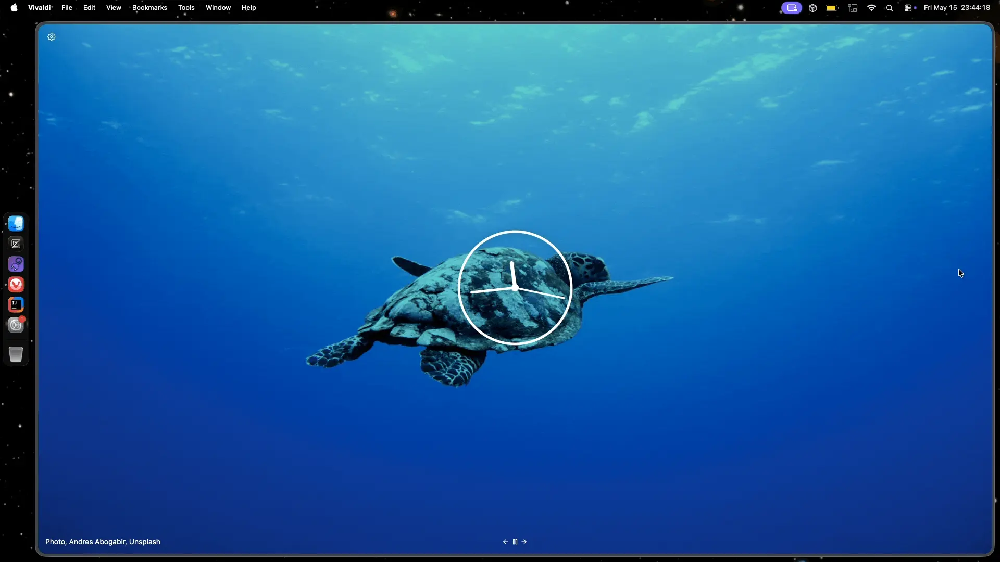

#  Lo-Phi (/'loʊ,faɪ/)

Lo-Fi variant of Phi, the ultimate vertical experience theme for Vivaldi, made with attention to details.

|  |  |
|---------------------------------|-------------------------------|

## :sparkles: Features

- Supported Vivaldi features : UI auto-hide, UI on left & right sides, theming from [themes.vivaldi.net](https://themes.vivaldi.net), toggle UI, panels, popups, split tabs ;
- Enhanced Vivaldi features :
  - Stacked tabs : displayed inline with titles (optional, enabled by default) ;
  - Pinned tabs : displayed as icon-only grid.

## :gear: Installation

1. Create a folder to download the mod into ;
2. Download the mod by right-clicking [here](https://git.kaki87.net/KaKi87/phi-for-vivaldi/raw/branch/master/Lo-Phi/Lo-Phi.css) then "Save Link As..." to the folder created in step 1 ;
3. Go to `vivaldi:flags` and next to "Allow CSS modifications", switch "Default" to "Enabled" ;
4. Open Vivaldi settings ;
   - (Optionally) Under "Appearance" ➔ "Window Appearance" ➔ "Status Bar", select "Status Info Overlay" ;
   - Under "Appearance" ➔ "UI Auto-Hide", check "Enable UI Auto-hide" (and optionally uncheck "Tab Bar") ;
   - Under "Appearance" ➔ "Custom UI Modifications", open the folder created in step 1 ;
   - Under "Tabs" ➔ "Tabs" ➔ "Tab Bar Position", select "Left" or "Right" ;
   - Under "Tabs" ➔ "Tab Features" ➔ "Tab Stacking", select "Compact" ;
   - Under "Panel" ➔ "Panel Position", select "Left" or "Right" (preferably the opposite of "Tab Bar Position") ;
   - (Optionally) Under "Address Bar" ➔ "Extension Visibility", check "Expand Hidden Extensions to Drop-Down Menu" ;
5. Quit and relaunch Vivaldi ;
6. Start tweaking the UI ;
   - Right-click anywhere on the UI then "Customize Toolbar..." ;
   - Move whatever you want (probably the navigation buttons, address bar and extensions) into the sidebar, before clicking "Done" ;
7. (Optionally) Star the [GitHub repo](https://github.com/KaKi87/phi-for-vivaldi) ;
8. Subscribe to Theo.

## :wrench: Troubleshooting

- Double check Vivaldi settings as per installation step 4 ;
- Find potentially incompatible settings by comparing with an empty profile ;
- You may disable Phi by setting the tab bar position to top or bottom or toggling the tab bar off ;
- Simultaneously using Phi with another CSS mod is not supported.

##  :handshake: Feedback & Support

- [Issues](https://git.kaki87.net/KaKi87/phi-for-vivaldi/issues)
- [GitHub Issues](https://github.com/KaKi87/phi-for-vivaldi/issues)
- [Discord](https://discord.gg/pdgQE6juqM)
- [Reddit](https://old.reddit.com/r/vivaldibrowser/comments/1ieyt5a/)
- [Vivaldi forum](https://forum.vivaldi.net/topic/105134/%CF%86-phi-the-ultimate-vertical-experience-theme-for-vivaldi-made-with-attention-to-details)

## 🛜 Why "Phi" ?

Phi (φ) is a greek letter, used (among other things) to designate angles, like (for example) [sextant](https://en.wikipedia.org/wiki/Sextant) () & [compass](https://en.wikipedia.org/wiki/Compass) () measurements for *navigation*.

This specific version, Lo-Phi, is named after the "Lo-Fi" music style, which initially stands for "low fidelity", as opposed to "Hi-Fi" which stands for "high fidelity".

Lo-Phi is indeed a "low-fidelity" variant of Phi, as it contains much less features, while also freed from the constraints of the original, like limited auto-hide support, and on Mac, limited right-side UI support.

---

© 2026 — KaKi87 
Released under the [MIT license](https://opensource.org/license/mit).