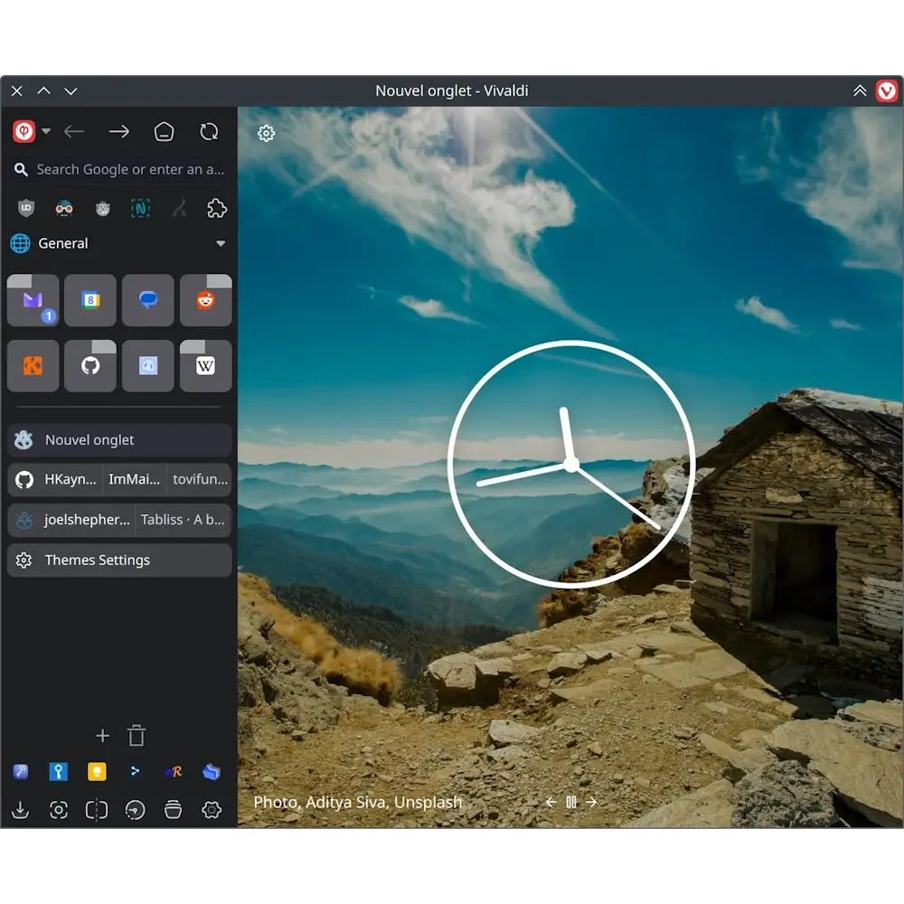
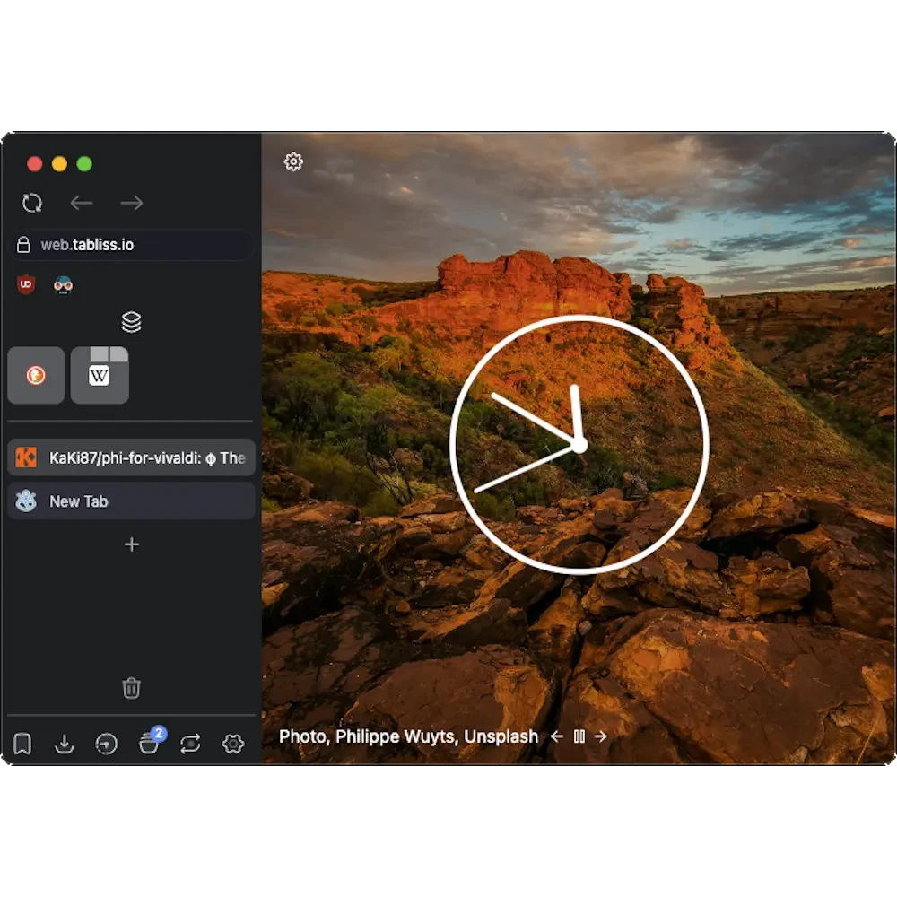
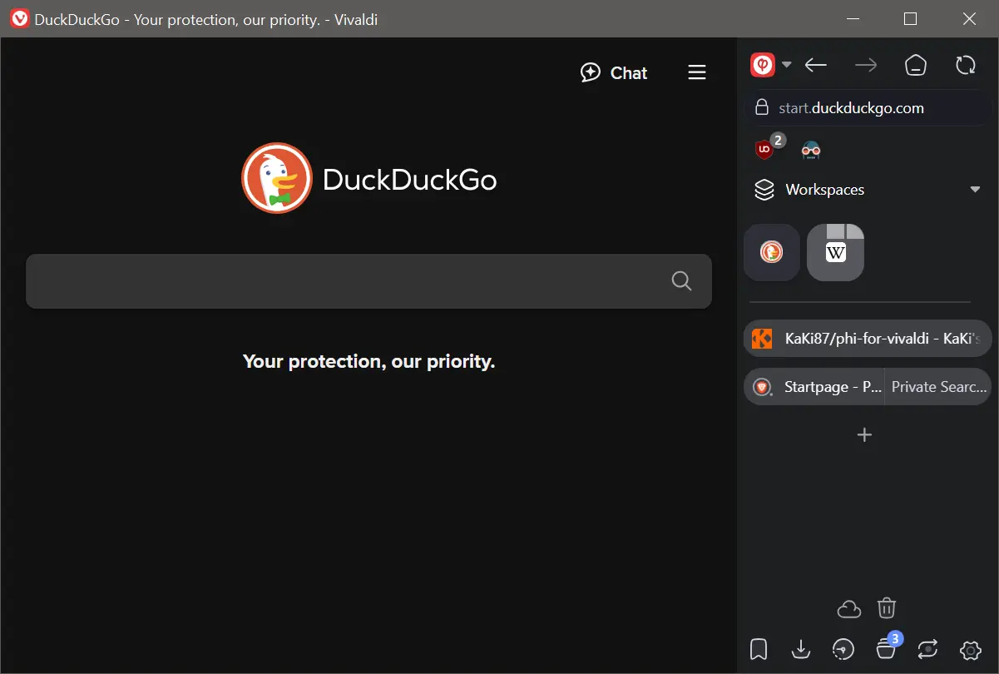
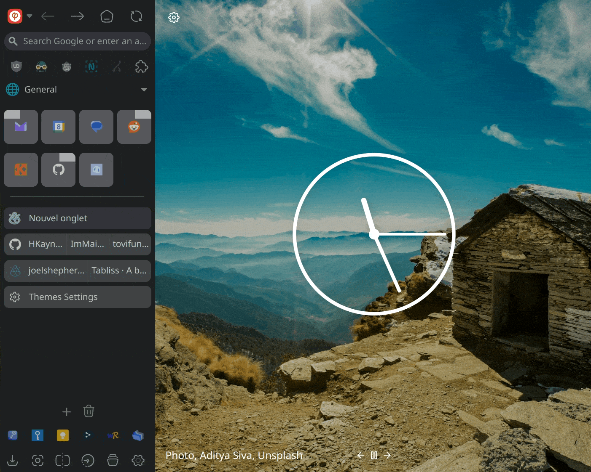
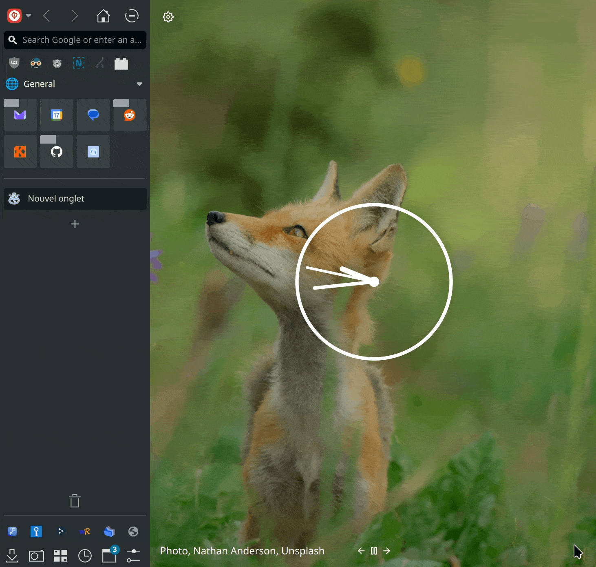
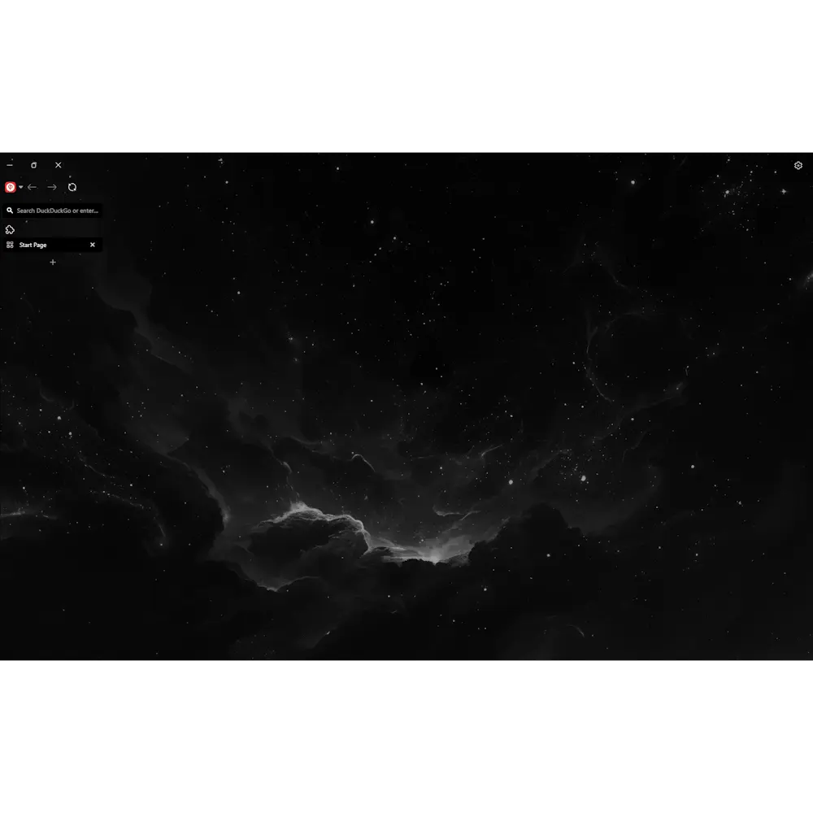
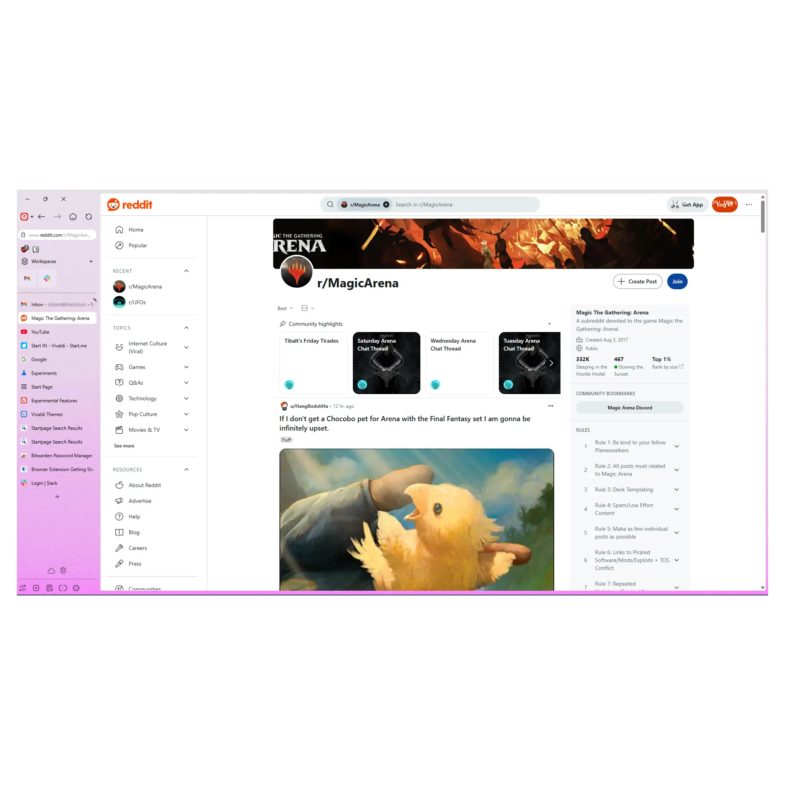

#  Phi (/faɪ/)

The ultimate vertical experience mod for Vivaldi, made with attention to details.

|             |           |             |
| ------------------------------------------ | -------------------------------------- | -------------------------------------------- |

## :sparkles: Features

- Supported Vivaldi features : UI on left & right sides, theming from [themes.vivaldi.net](https://themes.vivaldi.net), toggle UI, panels, popups, split tabs ;
- Enhanced Vivaldi features :
  - Stacked tabs : displayed inline with titles ;
  - Pinned tabs : displayed as icon-only grid ;
- Unique Phi features :
  - Address bar : expandable on focus, optional, enabled by default ;
  - Compact mode : icon-only sidebar, implemented under the "panel toggle" command, keyboard shortcut assignable.

## :camera_flash: More screenshots​

|   |   |  |
| ------------------------------------------- | -------------------------------------- | -------------------------------------------- |
| **Address bar** expands on focus (optional) | **Stacked tabs** inline                | **Pinned tabs** icon-only                    |
|              |  |               |
| **Panels** at the bottom                    | **Right side UI** supported            | **Themes** supported                         |
|       |                                        |                                              |
| **Compact mode** as "panel toggle"          |                                        |                                              |

## :gear: Installation

1. Create a folder to download the mod into ;
2. Download the mod by right-clicking [here](https://git.kaki87.net/KaKi87/phi-for-vivaldi/raw/branch/master/phi.css) then "Save Link As..." to the folder created in step 1 ;
3. Go to `vivaldi:experiments` and check "Allow CSS modifications" ;
4. Open Vivaldi settings ;
   - Under "General" ➔ "Startup" ➔ "Default Browser", uncheck "Check on Startup" ;
   - (Optionally) Under "Appearance" ➔ "Window Appearance", check "Use Native Window" ;
   - Under "Appearance" ➔ "Window Appearance" ➔ "Status Bar", select "Hide Status Bar" ;
   - Under "Appearance" ➔ "Custom UI Modifications", open the folder created in step 1 ;
   - Under "Tabs" ➔ "Tabs" ➔ "Tab Bar Position", select "Left" or "Right" ;
   - Under "Tabs" ➔ "Tab Display" ➔ "Tab Options", uncheck "Show Popup Thumbnails" ;
   - Under "Tabs" ➔ "Tab Features" ➔ "Tab Stacking", select "Compact" ;
   - (Optionally) Under "Tabs" ➔ "Panel Position", select "Left" or "Right" ;
   - Under "Panel" ➔ "Panels" ➔ "Panel Options", check "Floating Panel" ;
   - (Optionally) Under "Address Bar" ➔ "Extension Visibility", check "Expand Hidden Extensions to Drop-Down Menu" ;
   - (Optionally) Under "Keyboard" ➔ "View" ➔ "Panel Toggle", set a shortcut for compact mode ;
5. Quit and relaunch Vivaldi ;
6. Start tweaking the UI ;
   - Right-click in the blank above the URL bar then "Customize Toolbar..." ;
   - Right-click the space items then "Remove from Toolbar" : left to the "Back" button, below the URL bar, below the panel buttons at the bottom ;
   - Then add, move and remove whatever you want, before clicking "Done" ;
7. (Optionally) Star the [GitHub repo](https://github.com/KaKi87/phi-for-vivaldi) ;
8. Subscribe to Theo.

##  :hammer_and_wrench: Customization

While the mod aims to be compatible with as many native customization features as possible (especially sidebar position, side panel position & width, themes, etc.), some had to be moved (e.g. sidebar width), but more were also added, these are located in the file you downloaded, above the source code :

| Name                                     | Description                                                  | Value(s)                                  | Default |
| ---------------------------------------- | ------------------------------------------------------------ | ----------------------------------------- | ------- |
| `sidebar-width`                          | Amount of horizontal space for the area containing the whole UI.<sup>(1)</sup> | Any number (in pixels)                    | `210`   |
| `compact-sidebar-width`                  | Amount of horizontal space for the area containing the whole UI in compact mode.<sup>(1)</sup> | Any number (in pixels)                    | `50`    |
| `is-phi-menu-icon`                       | Whether to show Phi's logo in place of Vivaldi's as menu button. | `1` = enable<br />`0` = disable           | `1`     |
| `toolbar-column-count`                   | Number of toolbar buttons above the URL bar.<sup>(2)</sup>   | Any quantity                              | `5`     |
| `address-bar-focused-width-increase`     | Enlarge the URL bar over the page content when focused.      | Any number (in pixels)<br />`0` = disable | `200`   |
| `is-address-bar-focused-height-increase` | Whether to enlarge the URL bar over the extensions row below it when focused. | `1` = enable<br />`0` = disable           | `1`     |
| `address-bar-font-size-decrease`         | Lower the character size of the URL to see more of it.       | Any number (in pixels)<br />`0` = disable | `1`     |
| `is-address-bar-unfocused-hide-icons`    | Whether to hide icons<sup>(3)</sup> in the URL bar when not focused to see more of the URL. | `1` = enable<br />`0` = disable           | `1`     |
| `is-address-bar-focused-hide-icons`      | Whether to hide icons<sup>(3)</sup> in the URL bar when focused to see more of the URL. | `1` = enable<br />`0` = disable           | `0`     |
| `pinned-column-count`                    | Number of pinned tabs per row.                               | Any quantity                              | `4`     |
| `webview-border`                         | Amount of space around the page content.<sup>(4)</sup>       | Any number (in pixels)<br />`0` = disable | `0`     |
| `webview-border-radius`                  | Round the corners of the page content.<sup>(5)</sup>         | Any quantity<br />`0` = disable           | `0`     |

<sup>(1)</sup> Unfortunately, the sidebar cannot be resized by drag-and-drop.<br>
<sup>(2)</sup> Unfortunately, the toolbar cannot have more than one row (unless hard-coded to do so, trust me I tried hard).<br>
<sup>(3)</sup> With the exception of the following indicators : (in)valid HTTP(S), obfuscated domain name, loading.<br>
<sup>(4)</sup> Reduces page content area. When enabled, recommended value is `10`. A lower value will reveal an unavoidable page content width inconsistency between normal & split tabs.<br>
<sup>(5)</sup> When enabled, recommended value is `5`.

Applying modifications requires restarting Vivaldi.

## :wrench: Troubleshooting

- Double check Vivaldi settings as per installation step 4 ;
- Find potentially incompatible settings by comparing with an empty profile ;
- You may disable Phi by setting the tab bar position to top or bottom or toggling the tab bar off ;
- Simultaneously using Phi with another CSS mod is not supported.

##  :handshake: Feedback & Support

- [Issues](https://git.kaki87.net/KaKi87/phi-for-vivaldi/issues)
- [GitHub Issues](https://github.com/KaKi87/phi-for-vivaldi/issues)
- [Discord](https://discord.gg/pdgQE6juqM)
- [Reddit](https://old.reddit.com/r/vivaldibrowser/comments/1ieyt5a/)
- [Vivaldi forum](https://forum.vivaldi.net/topic/105134/%CF%86-phi-the-ultimate-vertical-experience-theme-for-vivaldi-made-with-attention-to-details)

## 🛜 Why "Phi" ?

Phi (φ) is a greek letter, used (among other things) to designate angles, like (for example) [sextant](https://en.wikipedia.org/wiki/Sextant) (<a href="https://en.wikipedia.org/wiki/Arc_(web_browser)" target="_blank"></a>) & [compass](https://en.wikipedia.org/wiki/Compass) (<a href="https://en.wikipedia.org/wiki/Safari_(web_browser)" target="_blank"></a>) measurements for *navigation*.

## :busts_in_silhouette: They use Phi

Are you using Phi ? You're welcome to star the [GitHub repo](https://github.com/KaKi87/phi-for-vivaldi), submit your feedback with (optionally) a screenshot to showcase your setup here !

<table><tr><td>


</td><td>


</td><td>


</td></tr><tr><td>

[@Rohit685](https://github.com/Rohit685) — Stargazer
</td><td>

[@sohamsarkar1993](https://github.com/sohamsarkar1993) — Stargazer
</td><td>

[@MaxedPC08](https://github.com/MaxedPC08) — Stargazer
</td></tr></table>

[](https://github.com/KaKi87/phi-for-vivaldi)

## :link: Related projects

- [ImMainTheme/ArchyVivaldi](https://github.com/ImMainTheme/ArchyVivaldi)
- [tovifun/VivalArc](https://github.com/tovifun/VivalArc)
- [(Address Bar + Title Bar + Status Bar) = Docked to side | Vivaldi Forum](https://forum.vivaldi.net/topic/80588/address-bar-title-bar-status-bar-docked-to-side)
- [HKayn/vivaldi-vh](https://github.com/HKayn/vivaldi-vh)

## :technologist: Development notes

Guide : [Customizing Vivaldi’s UI with CSS mods - gabevilela.vivaldi.net](https://gabevilela.vivaldi.net/2020/12/26/guide-customizing-vivaldis-ui-with-css-mods/)

DevTools URL : `vivaldi://inspect/#apps`

DOM structure :

```
#browser.linux.win.mac.minimal-ui.fullscreen.tabs-left.tabs-right
├─ [aria-label="Address"]
│  ├─ .vivaldi
│  ├─ .button-toolbar
│  ├─ .UrlBar-AddressField
│  └─ .toolbar-extensions
├─ [aria-label="Panels"]
│  └─ .button-toolbar.button-toolbar-webpanel
├─ .panel-group
├─ [name="WorkspaceButton"]
├─ #tabs-container
│  └─ .tab-strip
│     ├─ .tab-position.is-pinned
│     │  └─ .tab-wrapper.active.group
│     │     ├─ .tab.pinned.active.tab-group
│     │     │  └─ .tab-header
│     │     │     ├─ .favicon
│     │     │     ├─ .title
│     │     │     └─ .close
│     │     └─ .tab-group-indicator
│     │        └── .tab-indicator.active
│     ├─ .separator
│     └─ .newtab
└─ #webview-container
```

---

© 2025 — KaKi87<br>
Released under the [MIT license](https://opensource.org/license/mit).